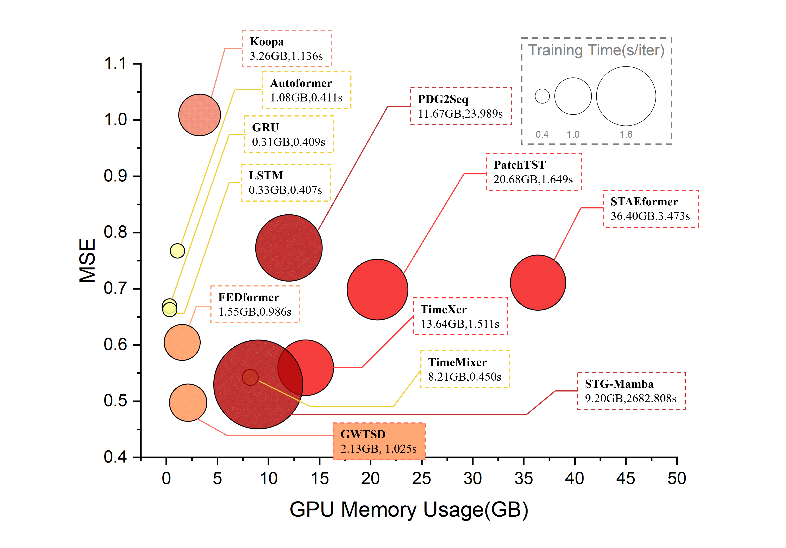
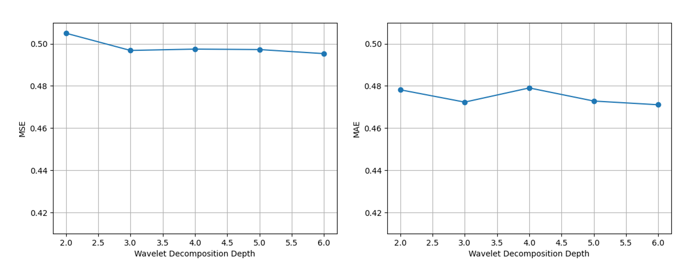
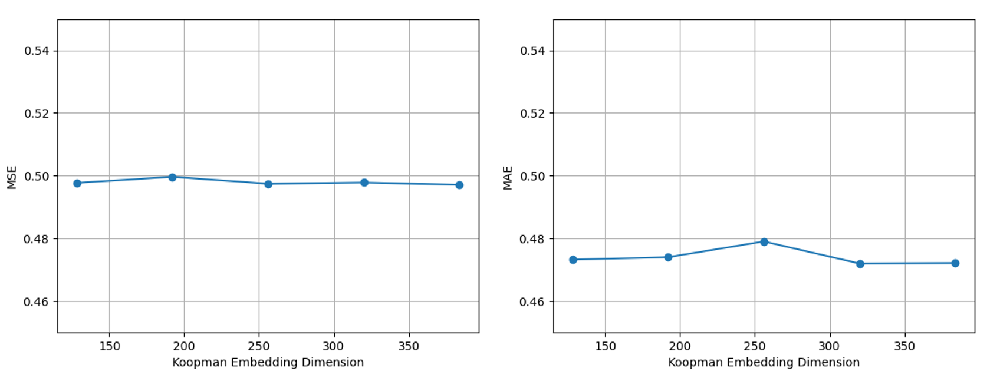

# QUICK START

1. Create enviroment.
```
conda create -n GWTSD python=3.8
conda activate GWTSD
```
2. Install neccessary dependencies.
```
pip install -r requirements.txt
```
3. Install torch-geometric
```
bash install_geometric.sh
```
4. Run our provied scripts to start.
```
bash ./scripts/XIAN/GWTSD.sh
```

# Supplementary Experiments
Due to the page limit of the main text and the response length, we provide further experimental results here to address concerns regarding the rigor of our experiments.
## Model Efficiency Study
<p align="center">
  <br>
  <em>Fig1. Model Efficiency Study</em>
</p>

We evaluate model efficiency through three dimensions including prediction performance, GPU memory usage and training speed as shown in Fig. 1. Horizontal axis represents the maximum GPU memory usage while training, and vertical axis represents the prediction accuracy measured by MSE. Bubbles represent the time consumed for each iteration, larger and darker bubbles represents more consumed time.

As shown in Fig. 1, under the setting with a prediction horizon of 96, GWTSD achieves the best forecasting performance. Compared with STG-Mamba, which ranks second in terms of forecasting efficiency, GWTSD improves the prediction accuracy by 6.12%, while consuming only 23.66% of the GPU memory used by STG-Mamba. Moreover, STG-Mamba requires three orders of magnitude more training time per iteration than GWTSD.

In fact, compared with other spatiotemporal forecasting methods, including STAEformer, STG-Mamba, and PDG2Seq, GWTSD exhibits remarkable advantages in both GPU memory consumption and training speed. Compared with the decomposition-based method FEDformer, GWTSD achieves a 17.72% improvement in forecasting efficiency under comparable computational resource consumption. Compared with TimeMixer, which achieves the best forecasting efficiency among multi-scale methods, GWTSD improves the forecasting accuracy by 8.27%, while using only 25.94% of the GPU memory required by TimeMixer.

 In general, we can observe that GWTSD demonstrates advanced overall performance in balancing prediction accuracy and computational resource consumption.


## Hyperparameter Sensitivity Analysis
### Wavelet Decomposition Depth
<p align="center">
  <br>
  <em>Fig2. Comparison Study in Wavelet Decomposition Depth </em>
</p>
We conduct experiments to investigate the impact of different wavelet decomposition depths on the performance of GWTSD. As shown in Fig. 2, we vary the decomposition depth from 2 to 5 and evaluate the model's forecasting accuracy on the dataset with a prediction horizon of 96. 
The relative variations of MSE and MAE are 1.95% and 1.69%, respectively, indicating low sensitivity to wavelet decomposition depth.

### Koopman Embedding Dimension
<p align="center">
  <br>
  <em>Fig3. Comparison Study in Koopman Embedding Dimension </em>
</p>
We also conduct experiments on the impact of different Koompan embedding dimension on GWTSD. As shown in Fig. 3, we vary the decomposition depth from 2 to 5 and evaluate the model's forecasting accuracy on the dataset with a prediction horizon of 96. 
The relative variations of MSE and MAE are 0.51% and 1.48%, respectively, indicating low sensitivity to wavelet decomposition depth.


